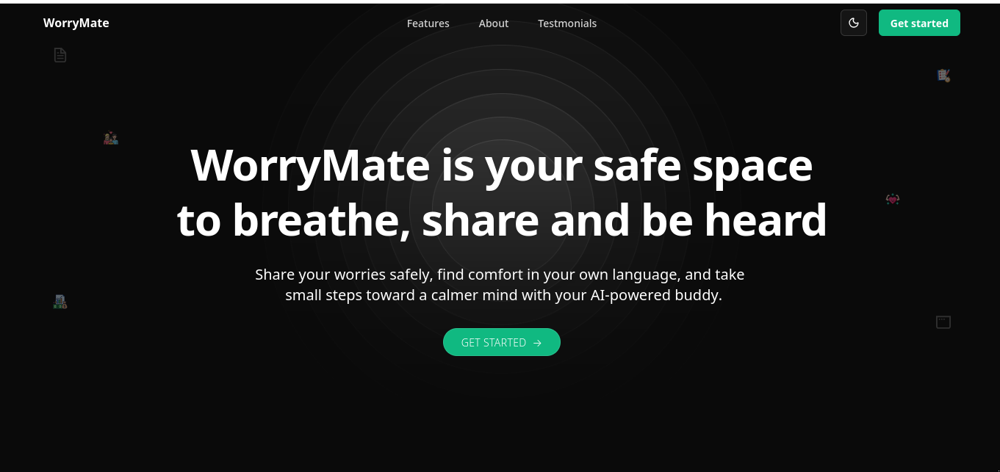
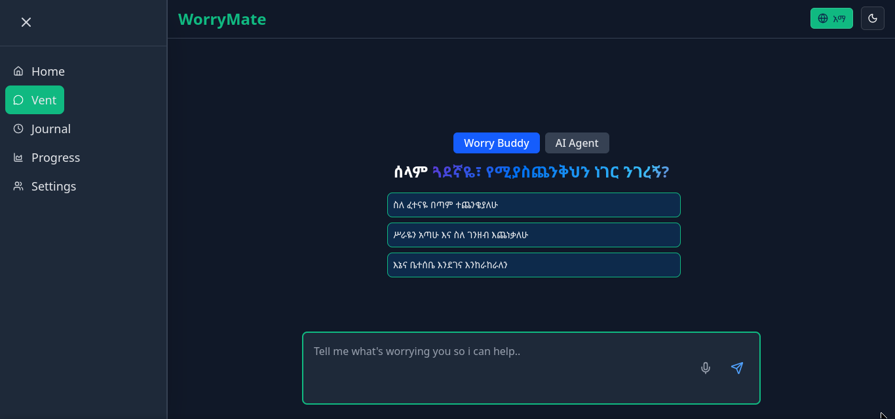

<div align="center">


# WorryMate 🌿
### AI-Powered Wellbeing Companion for Africa

**Bilingual · Offline-First · Crisis-Ready · Built for Low-Bandwidth Realities**

[](LICENSE)
[](https://golang.org)
[](https://nextjs.org)
[](https://ai.google.dev)
[](https://web.dev/progressive-web-apps/)
[](https://github.com)

*Mental health support, built by Africans, for Africans — because wellbeing should never depend on bandwidth.*

</div>

---

## 📸 Screenshots

<div align="center">

### Landing Experience


### Venting & Chat Interface


</div>

---

## 🌍 Why WorryMate?

Mental health infrastructure across Africa remains critically underfunded. In Ethiopia alone, there is approximately **1 psychiatrist per 1 million people**. Cultural stigma, language barriers, unreliable internet, and the complete absence of locally-adapted digital tools leave millions without any accessible support.

WorryMate was built to close that gap — not by replacing professional care, but by being the first point of contact: a safe, private, bilingual space that meets users exactly where they are.

> *"You shouldn't need a strong internet connection to get mental health support."*

---

## ✨ Core Features

### 🗣️ Bilingual AI Conversation
Full conversational support in **Amharic and English** — not translation, but genuine language-native interaction. Users can switch mid-conversation without losing context.

### 🧠 Contextual AI with RAG
Powered by **Google Gemini** with a custom **Retrieval-Augmented Generation (RAG)** layer built in Go — giving the AI grounded, accurate, culturally-aware responses and eliminating hallucinations in high-stakes mental health contexts.

### 🔴 Real-Time Risk Detection
Every conversation is silently assessed by a `GenerateRiskCheck` module that outputs structured **risk levels (1–3) and topic tags** — enabling appropriate escalation to crisis resources without disrupting the user experience.

### 📦 Offline-First Action Cards
Pre-loaded **Action Cards** cover 16 mental health topics in 3 languages (**English, Amharic, Swahili**), including:
- General wellbeing: anxiety, grief, loneliness, sleep, motivation
- Activist & journalist specific: `digital_safety_anxiety`, `activist_burnout`, `surveillance_fear`

All cards are available **without internet** via a structured offline pack — critical for users in low-connectivity regions.

### 🆘 Crisis Card System
For users in acute distress, WorryMate dynamically generates a **Crisis Card** — pulling verified regional crisis contacts, safety plans, and HRD-specific resources (Frontline Defenders, Access Now) based on the user's region (Ethiopia, Sudan, Somalia, Mali).

### 🔒 Privacy-First Architecture
- Anonymous by default — no account required to use core features
- No conversation data stored beyond session unless explicitly opted in
- Designed for users who face real surveillance risks

---

## 🏗️ Architecture

```
┌─────────────────────────────────────────────────────────────┐
│                    Client (Next.js PWA)                      │
│           TypeScript · Offline Cache · Low-bandwidth UI      │
└─────────────────────┬───────────────────────────────────────┘
                      │  REST API
┌─────────────────────▼───────────────────────────────────────┐
│                   Go / Gin Backend                           │
│                                                              │
│  ┌─────────────┐  ┌──────────────┐  ┌───────────────────┐  │
│  │   Delivery  │  │   Usecase    │  │   Infrastructure  │  │
│  │ Controllers │→ │  Orchestrate │→ │   ai.go (Gemini)  │  │
│  │   Routers   │  │  Risk Check  │  │   Round-robin     │  │
│  └─────────────┘  │  Intent Map  │  │   key pool        │  │
│                   │  Crisis Card │  └───────────────────┘  │
│                   └──────────────┘                          │
│  ┌─────────────────────────────────────────────────────┐   │
│  │              Repository Layer                        │   │
│  │  MongoDB (chats) · JSON assets (offline_pack,       │   │
│  │  region.json) · In-memory action block cache        │   │
│  └─────────────────────────────────────────────────────┘   │
└─────────────────────────────────────────────────────────────┘
```

### Clean Architecture
The backend strictly follows **Clean Architecture** principles with four distinct layers:

| Layer | Responsibility |
|---|---|
| `Delivery` | HTTP controllers, routing, request/response DTOs |
| `Usecase` | Business logic orchestration |
| `Repository` | Data access — MongoDB + JSON asset loading |
| `Infrastructure` | External services — Gemini AI client pool |

---

## 🔌 API Reference

| Method | Endpoint | Description |
|--------|----------|-------------|
| `POST` | `/chat/normal` | AI conversation with optional context |
| `POST` | `/chat/compose` | Generate structured action card |
| `POST` | `/chat/risk_check` | Assess risk level + extract tags |
| `POST` | `/chat/intent_mapping` | Map user intent to topic key |
| `POST` | `/chat/crisis_card` | Generate regional crisis card |
| `POST` | `/chat/summarize` | Summarize conversation context |
| `GET` | `/chat/resources` | Get regional crisis resources |
| `GET` | `/chat/offline_pack` | Full offline action block pack by language |
| `GET` | `/chat/action_block/:topic/:lang` | Single action block lookup |

---

## 🗂️ Supported Topics & Languages

### 16 Mental Health Topics

| Category | Topics |
|---|---|
| General Wellbeing | `anxiety` · `grief` · `loneliness` · `sleep` · `motivation` · `work_stress` · `relationship_stress` · `other` |
| Productivity | `study_stress` · `workload` · `procrastination` · `time_management` · `exam_panic` |
| Life Transitions | `money_stress` · `family_conflict` · `new_city_anxiety` · `self_confidence` |
| HRD-Specific | `digital_safety_anxiety` · `activist_burnout` · `surveillance_fear` |

### 3 Languages, Fully Supported

| Language | Code | Coverage |
|---|---|---|
| English | `en` | All 16 topics |
| Amharic (አማርኛ) | `am` | All 16 topics |
| Swahili (Kiswahili) | `sw` | All 16 topics |

### 4 Regional Crisis Databases

| Region | Code | Resources |
|---|---|---|
| Ethiopia | `ET` | National hotline · Agar Ethiopia · MSF · Access Now · Frontline Defenders |
| Sudan | `SD` | WHO Sudan · IMC · MSF · Access Now Signal · CPJ Emergency |
| Somalia | `SO` | Somali Mental Health Foundation · MSF · ICRC · Frontline Defenders |
| Mali | `ML` | Centre Santé Mentale Bamako · MSF · IRC · Access Now · RSF Africa |

---

## 🚀 Getting Started

### Prerequisites

- Go 1.24+
- Node.js 18+
- MongoDB
- Google Gemini API key(s)

### 1. Clone the repository

```bash
git clone https://github.com/your-org/worrymate.git
cd worrymate
```

### 2. Configure environment

```bash
cp .env.example .env
```

```env
MONGO_URL=mongodb://localhost:27017
GEMINI_API_KEYS=key1,key2,key3   # Comma-separated for round-robin load balancing
GEMINI_MODEL=gemini-1.5-flash
```

### 3. Run the backend

```bash
cd sema_backend
go mod download
go run main.go
# Server starts on :8080
```

### 4. Run the frontend

```bash
cd frontend
npm install
npm run dev
# App available at http://localhost:3000
```

### 5. Verify

```bash
curl -X POST http://localhost:8080/chat/risk_check \
  -H "Content-Type: application/json" \
  -d '{"content": "I have been feeling very anxious lately"}'
```

---

## 🧪 Testing

```bash
# Backend unit tests
cd sema_backend
go test ./...

# Run specific test suite
go test ./Repository/...
go test ./Usecase/...
go test ./Delivery/Controllers/...
```

The test suite covers controllers, usecases, and repository layers using mock interfaces — ensuring business logic is fully isolated and testable without live AI or database dependencies.

---

## 📁 Project Structure

```
worrymate/
├── sema_backend/
│   ├── main.go                        # Entry point — DI wiring
│   ├── Domain/
│   │   ├── entities.go                # Core domain structs
│   │   └── interfaces.go              # Dependency contracts
│   ├── Delivery/
│   │   ├── Controllers/
│   │   │   ├── chat_controller.go     # HTTP handlers
│   │   │   └── chat_controller_test.go
│   │   ├── Routers/router.go          # Gin route setup
│   │   └── mocks/                     # Mock implementations for testing
│   ├── Usecase/
│   │   ├── chat_usecase.go            # Business logic
│   │   └── chat_usecase_test.go
│   ├── Repository/
│   │   ├── chat_repository.go         # Data access + asset loading
│   │   └── db.go                      # MongoDB connection
│   ├── Infrastructure/
│   │   └── ai.go                      # Gemini client pool + all AI methods
│   └── assets/
│       ├── offline_pack.json          # 48 action blocks × 3 languages
│       └── resources/
│           └── region.json            # 4 regional crisis databases
└── frontend/
    ├── app/                           # Next.js app router
    ├── components/                    # UI components
    └── public/                        # PWA assets + service worker
```

---

## 🌱 Roadmap

- [ ] **v1.1** — Expand regional database to Kenya, Nigeria, Cameroon
- [ ] **v1.2** — Add French language support (for Mali, Cameroon, Senegal)
- [ ] **v1.3** — Threat logging module for HRDs — track, classify, and report threatening messages over time
- [ ] **v1.4** — Partner API for NGO integration
- [ ] **v2.0** — Community peer support layer with moderation

---

## 🤝 Contributing

We welcome contributions — especially from African developers, mental health practitioners, and community organizations.

1. Fork the repository
2. Create a feature branch: `git checkout -b feature/your-feature`
3. Commit your changes: `git commit -m 'Add: your feature description'`
4. Push and open a pull request

Please read our [Contributing Guide](CONTRIBUTING.md) and [Code of Conduct](CODE_OF_CONDUCT.md) before submitting.

---

## 🙏 Acknowledgements

- **Google Gemini** — AI backbone
- **Frontline Defenders** — Crisis resource verification for HRD regions
- **Access Now** — Digital security helpline integration
- **Dart Center for Journalism & Trauma** — Content guidance for journalist-specific topics
- **Headington Institute** — Humanitarian worker wellbeing framework

---

## 📄 License

MIT License — free to use, adapt, and build upon for research, NGO, and community use.

---

<div align="center">

**Built with 🌿 in Addis Ababa**

*If this project helps even one person feel less alone, it was worth building.*

</div>